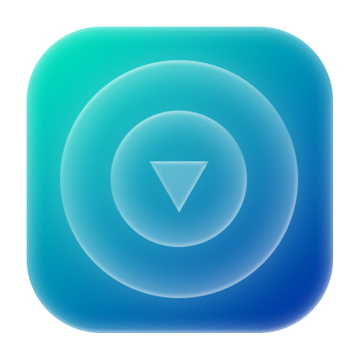
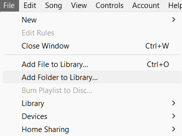
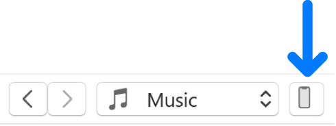
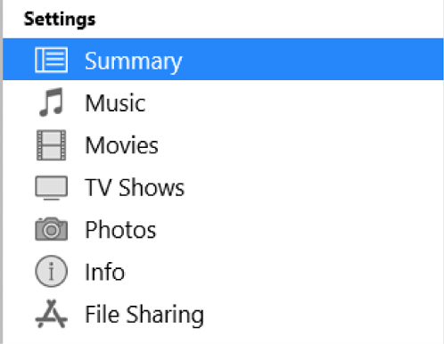
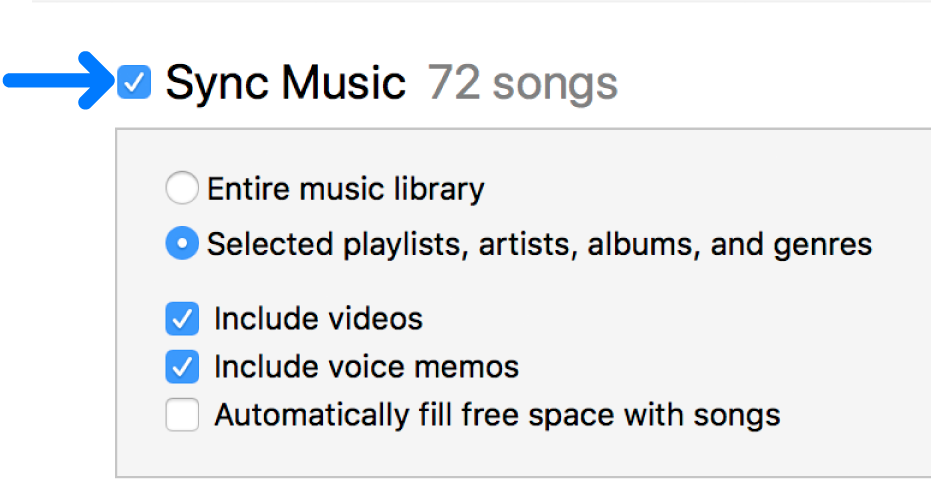

# iTuneUp – Apple Music-style Downloads for Local Libraries
 **iTuneUp** is a standalone Windows desktop application that lets you build a local `.m4a` music library styled after Apple Music, using content sourced from YouTube and metadata from Apple’s own public database. Unlike conventional downloaders, iTuneUp delivers an authentic, metadata-rich music collection — with cover art, track order, release dates, and more — just like purchased albums in iTunes.

<div align="center">
  
  [](https://github.com/kalis26/iTuneUp/stargazers)
  [](https://github.com/kalis26/iTuneUp/forks)
  [](https://github.com/kalis26/iTuneUp/issues)
  [](https://github.com/kalis26/iTuneUp/blob/main/LICENSE)
  
</div>

## ✨ Core Features
- Download entire albums or individual tracks directly from YouTube via search.
- Convert audio streams into `.m4a` (MPEG-4 Part 14) format using the **Advanced Audio Coding (AAC)** codec — the same audio compression used by Apple Music.
- Enrich downloaded files with Apple Music metadata, including:
  * Track title
  * Album and artist name
  * Release date
  * Album artwork (632×632px high-quality JPEG)
  * Track order, genre, and Apple Music-specific tags
- Automatically name and organize files for proper integration with iTunes or third-party players.
- Create a truly **"Apple Music–like" experience** for your local music collection — without subscriptions.
- Native Windows installer with:
  * Shortcut creation
  * Uninstaller
- Modern UI powered by a built-in WebView interface (no browser needed)

## 📦 Technologies Used
- **Language:** Python 3.12.7
- **GUI:** [Flask](https://flask.palletsprojects.com/en/stable/) backend + [PyWebView](https://pywebview.flowrl.com/) native shell
- **Download engine:** [yt-dlp](https://github.com/yt-dlp/yt-dlp) -- for high-accuracy YouTube media downloading
- **Audio conversion:** [ffmpeg](https://ffmpeg.org/) -- for audio conversion and stream extraction
- **Metadata embedding:** [mutagen](https://mutagen.readthedocs.io/) -- for embedding metadata into `.m4a` files
- **Metadata scraping:** Selenium + requests – to scrape and retrieve metadata from Apple Music’s public web pages

## 🖥️ System Requirements
- **Operating System:** Windows 10 (64 bits) or later
- **Disk Space:** ~150 MB (excluding downloaded music)
- **Internet Access:** Required for metadata & download
- **Google Chrome:** Required for Apple Music scraping
```
⚠️ Python & dependencies are not required, as iTuneUp is packaged as a complete .exe app.
```

## 📂 Installation & Uninstallation
- Download `iTuneUp-Setup.exe` from the [Releases](https://github.com/kalis26/iTuneUp/releases)
- Run the installer — you can:
  * Add desktop/start menu shortcut
- To uninstall, go to **Control Panel > Apps > iTuneUp**, or run `Uninstall iTuneUp` from the Start menu

## 🔒 License
Licensed under the [MIT License](https://github.com/kalis26/iTuneUp/blob/main/LICENSE)

## Use Cases
- Build a curated, metadata-rich `.m4a` library using free online content.
- Sync personalized albums with iTunes, iOS devices, or third-party players.
- Archive rare or live recordings with high-efficiency encoding and clean metadata.
- Combine streaming convenience with local ownership and detailed music info.

## How to Add to iTunes and Sync with iPhone/iPad
Once you've used **iTuneUp** to download and tag `.m4a` tracks with rich metadata, you can seamlessly add them to your iTunes library on PC and sync them to your iPhone or iPad for a native Apple Music–like experience.
### 1st - Add Songs to iTunes Library
1. Go to the iTunes  app on your Windows PC (latest version recommended).
   
2. In the menu bar, go to: **File > Add Folder to Library...**


3. Navigate to the `{album_name}/` folder generated by **iTuneUp** (or wherever you chose to save your files).

4. Select the folder containing the album or tracks and click **Select Folder**.

5. iTunes will import the songs, retaining:
  * Track order
  * Album name
  * Artist(s)
  * Artwork
  * Genre
  * Release year
  * And many more tags.

🟢 If metadata was properly injected by iTuneUp, you'll see a fully-tagged album with its cover art — just like official Apple Music content. 

### 2nd - Enable Manual or Automatic Sync
1. Connect your iPhone/iPad to your computer using a USB cable.
 
2. iTunes will recognize your device and show it in the top-left corner. Click on the device icon. 


3. Select a type of content you want to sync in the sidebar (Music in our case).


  *Note:* If you use iCloud Photos and Apple Music, your photos and music are synced automatically with iCloud. When you click Music or Photos, no options appear for syncing.

4. Select the Sync checkbox, then select the items you want to sync automatically each time you connect your device. 


5. By default, iTunes syncs your device whenever you connect it to your computer. If you want iTunes to ask you before syncing, do one of the following:
  * *Require a prompt before syncing this device:* Click Summary, then deselect “Automatically sync when this [*device*] is connected.”
  * *Require a prompt before syncing all devices*: Choose Edit > Preferences, click Devices, then select “Prevent iPods, iPhones, and iPads from syncing automatically.”

6. When you’re ready to sync, click Apply.

 **Tip:** To automatically sync a connected device at any time, choose File > Devices > Sync [*device name*].\
\
**WARNING:** If you delete an automatically synced item from your iTunes library, the deleted item is removed from your device the next time you sync.

### 3rd - Enjoy Your Music on Your iPhone/iPad
- Once syncing is complete, open the Music app on your iPhone or iPad.
  
- Navigate to: **Library > Albums**
  
- You’ll see the newly added album with full Apple-style formatting: proper cover art, album info, and track structure.

🎉 Congratulations! You now have YouTube-sourced music enriched with **Apple Music metadata** on your iPhone — **no subscriptions required**, and fully integrated with iTunes' ecosystem.
